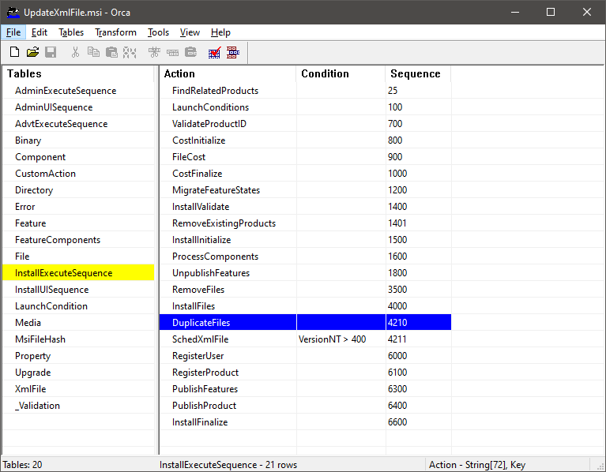
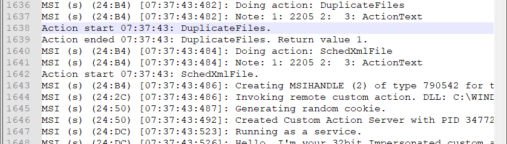
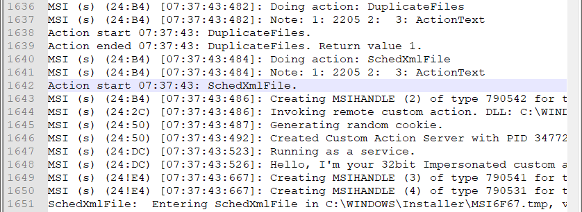
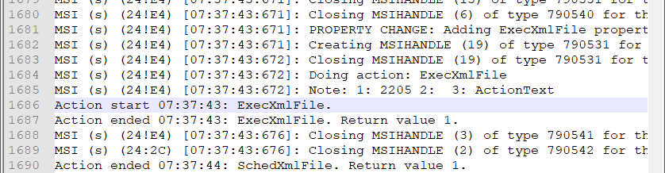
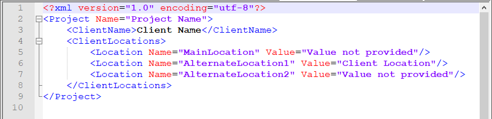

# Update XML File

## Overview

Sometimes, when deploying our application, we need to also update the contents of an xml file. It may be a config file or any other xml file.

Currently I think of two ways to do this:

1. One way would be to create a custom action and update the XML file from C#.
2. The other options is to use `<util:XmlFile>` tag from the WiX Toolset extension `WixUtilExtension.dll`.

In this tutorial we'll present the second solution. For creating custom actions, please check these tutorials:

- [Deferred Custom Action](https://github.com/WiX-Toolset-Pills-15mg/Deferred-Custom-Action)
- [Deferred Custom Action with Params](https://github.com/WiX-Toolset-Pills-15mg/Deferred-Custom-Action-with-Params)

## Start

### Step 0 - Create a simple project

Create a simple project that deploys a single dummy file.

See the [My First Installer](https://github.com/WiX-Toolset-Pills-15mg/My-First-Installer) pill.

### Step 1 - Create and deploy an XML File

Let's create a new xml file. Let's call it `some-file.xml`:

- Solution Explorer -> right click on the project -> Add -> New Item... -> Text File -> Name: some-file.xml -> click Add

Here is the content of the xml file:

```xml
<?xml version="1.0" encoding="utf-8"?>

<Project Name="Value not provided">
    <ClientName>Value not provided</ClientName>
    <ClientLocations>
        <Location Name="MainLocation" Value="Value not provided"/>
        <Location Name="AlternateLocation1" Value="Value not provided"/>
        <Location Name="AlternateLocation2" Value="Value not provided"/>
    </ClientLocations>
</Project>
```

### Step 2 - Create a component for the xml file

This file must be added into a component. We can put this component next to the dummy file's component, in the same group:

```xml
<ComponentGroup Id="FileComponents" Directory="INSTALLFOLDER">
    ...
    <Component Id="SomeXmlFileComponent" Guid="0C2FAC03-FA33-45C2-B1CC-83BBA655D051">
        <File
            Id="SomeXmlFile"
            Source="$(var.ProjectDir)some-file.xml"
            KeyPath="yes" />
    </Component>
</ComponentGroup>
```

**Note**: The `FileComponents` is already added into the only feature of the project so nothing to be done here. If we place the new component outside this group, ether alone or inside another group, it must be also added into a feature.

### Step 3 - Reference WiX Util Extensions

First, let's reference the `WixUtilExtension.dll` file. Right click the project -> Add -> Reference... and browse to select the dll file. It can be found in the WiX Toolset installation directory. Usually it is in the following location `C:\Program Files (x86)\WiX Toolset v3.11\bin\\WixUtilExtension.dll`


### Step 4 - Add the XML namespace

To use the `XmlFile` extension from WiX Toolset, beside referencing the `WixUtilExtension.dll` file we also need to specify the namespace like this:

```xml
<Wix
    xmlns="http://schemas.microsoft.com/wix/2006/wi"
    xmlns:util="http://schemas.microsoft.com/wix/UtilExtension">
</Wix>
```

### Step 5 - Add the `XmlFile` Element

The `XmlFile` element can be added as part of the same component as the xml file that is deployed or as a separate component.

Let's have an example:

```xml
<Component ...>
    <File
        Id="SomeXmlFile"
        Source="$(var.ProjectDir)some-file.xml"
        KeyPath="yes" />

    <util:XmlFile
        Id="SomeXmlFile_SetProjectName"
        File="[#SomeXmlFile]"
        Action="setValue"
        ElementPath="/Project/@Name"
        Value="[PROJECT_NAME]"/>
</Component>
```

The `XmlFile` element needs a few information:

- An unique `Id`;

- The `File` to be updated:

  - If the file is deployed by the same installer, we can provide here its `Id` and the installer will take care to use its actual path from after it is deployed. Remember that, this `<XmlFile>` is updating the file after it is deployed. The above example demonstrates how to use the id of the deployed file in the way we described.
  - Alternatively, we can use the full path to the deployed file from the target machine.  Here is the same example using the path to the file:

  ```xml
  <util:XmlFile
      Id="XmlFile_SetProjectName"
      File="[INSTALLFOLDER]some-file.xml"
      Action="setValue"
      ElementPath="/Project/@Name"
      Value="[PROJECT_NAME]"/>
  ```

  **Note**: We used the `INSTALLFOLDER` property to reference the location where the product is installed.

- For the `Action` attribute we used `setValue` because we intended to update existing elements. Possible values are : `createElement`, `deleteValue`, `setValue`, `bulkSetValue`. For more details please check the WiX Toolset documentation:

  - https://wixtoolset.org/documentation/manual/v3/xsd/util/xmlfile.html

- The `ElementPath` is an xPath that locates the element to be updated;

- The `Value` is the value to be written.

The project provides three examples:

- Update the `Name` attribute of the `Project` tag;

  ```xml
  <util:XmlFile
      Id="SomeXmlFile_SetProjectName"
      File="[#SomeXmlFile]"
      Action="setValue"
      ElementPath="/Project/@Name"
      Value="[PROJECT_NAME]" />
  ```

- Update the `ClientName` tag;

  ```xml
  <util:XmlFile
      Id="SomeXmlFile_SetClientName"
      File="[INSTALLFOLDER]some-file.xml"
      Action="setValue"
      ElementPath="/Project/ClientName"
      Value="[CLIENT_NAME]" />
  ```

- Update the `Value` attribute of the `Location` tag that has the `Name` attribute equal to `AlternateLocation1`.

  ```xml
  <util:XmlFile
      Id="SomeXmlFile_SetClientAlternateLocation1"
      File="[INSTALLFOLDER]some-file.xml"
      Action="setValue"
      ElementPath="/Project/ClientLocations/Location[\[]@Name='AlternateLocation1'[\]]/@Value"
      Value="[CLIENT_ALTERNATE_LOCATION_1]" />
  ```

### Step 6 - Run the installer

Build the project

#### Orca

Open the resulted MSI file using Orca. You will see there two new custom actions: `DuplicateFiles` and `SchedXmlFile` added after the `InstallFiles`.



#### Log file

After installing the product, using the `install.bat` script, open the `install.log` file. We can see the two custom actions we talked above:

- `DuplicateFiles` custom action is executed:



- `SchedXmlFile` custom action is executed:



- an additional custom action, the `ExecXmlFile`, is executed inside the `SchedXmlFile`:



#### The deployed XML file

Open the deployed xml file. (Default location would be: `c:\Program Files (x86)\WiX Toolset Pills 15mg\Update XML File\`) and see the changes:


