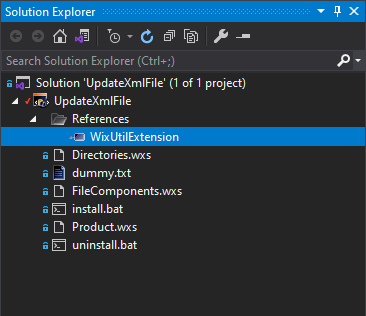

# Update XML File

## Overview

Sometimes, when deploying our application, we need to also update the contents of an xml file. It may be a config file or any other xml file.

Currently I think of two ways to do this:

1. One way would be to create a custom action and update the XML file from C#.
2. The other options is to an WiX Toolset extension from `WixUtilExtension.dll` library.

In this tutorial we'll present the second solution. For creating custom actions, please check these tutorials:

- [Deferred Custom Action with Params](https://github.com/WiX-Toolset-Pills-15mg/Deferred-Custom-Action-with-Params)
- [Deferred Custom Action](https://github.com/WiX-Toolset-Pills-15mg/Deferred-Custom-Action)
- [Immediate Custom Action with Params](https://github.com/WiX-Toolset-Pills-15mg/Immediate-Custom-Action-with-Params)
- [Immediate Custom Action](https://github.com/WiX-Toolset-Pills-15mg/Immediate-Custom-Action)

## Start

### Step 1 - Reference WiX Util Extensions

First, let's reference the `WixUtilExtension.dll` file. Right click the project -> Add -> Reference... and browse to select the dll file. It can be found in the WiX Toolset installation directory. Usually it is in the following location `C:\Program Files (x86)\WiX Toolset v3.11\bin\\WixUtilExtension.dll`



### Step 2 - Add the XML namespace

To use the `XmlFile` extension from WiX Toolset, beside referencing the `WixUtilExtension.dll` file we also need to specify the namespace like this:

```xml
<Wix
    xmlns="http://schemas.microsoft.com/wix/2006/wi"
    xmlns:util="http://schemas.microsoft.com/wix/UtilExtension">
</Wix>
```

### Step 3 - Create and deploy an XML File

Here it is a dummy XML file we can deploy. Let's call it `some-file.xml`:

```xml
<?xml version="1.0" encoding="utf-8"?>
<Project Name="Value not provided">
    <ClientName>Value not provided</ClientName>
    <ClientLocations>
        <Location Name="MainLocation" Value="Value not provided"/>
        <Location Name="AlternateLocation1" Value="Value not provided"/>
        <Location Name="AlternateLocation2" Value="Value not provided"/>
    </ClientLocations>
</Project>
```

This file must be added into a component:

```xml
<ComponentGroup Id="FileComponents" Directory="INSTALLFOLDER">
    <Component Id="Component_SomeXmlFile" Guid="0C2FAC03-FA33-45C2-B1CC-83BBA655D051">
        <File
            Id="SomeXmlFile"
            Source="$(var.ProjectDir)some-file.xml"
            KeyPath="yes" />
    </Component>
</ComponentGroup>
```

And the component into a feature:

```xml
<Feature Id="ProductFeature" Title="UpdateXmlFile" Level="1">
    <ComponentGroupRef Id="FileComponents" />
</Feature>
```

For more details, please check out the tutorial:

- [My First Installer](https://github.com/WiX-Toolset-Pills-15mg/My-First-Installer)

### Step 4 - Add the `XmlFile` Element

The `XmlFile` element can be added as part of the same component as the xml file that is deployed or as a separate component.

Let's have an example:

```xml
<Component
    Id="Component_SomeXmlFile"
    Guid="0C2FAC03-FA33-45C2-B1CC-83BBA655D051"
    Directory="INSTALLFOLDER">
    
    <File
        Id="SomeXmlFile"
        Source="$(var.ProjectDir)some-file.xml"
        KeyPath="yes" />

    <util:XmlFile
        Id="XmlFile_SetProjectName"
        File="[#SomeXmlFile]"
        Action="setValue"
        ElementPath="/Project/@Name"
        Value="[PROJECT_NAME]"/>
</Component>
```

The `XmlFile` element needs a few information:

- An unique `Id`;

- The `File` to be updated - This can be the actual path to the file or the id of the deployed file. The above example demonstrates how to use the id of the deployed file. Here is the same example using the path to the file:

  ```xml
      <util:XmlFile
          Id="XmlFile_SetProjectName"
          File="[INSTALLFOLDER]some-file.xml"
          Action="setValue"
          ElementPath="/Project/@Name"
          Value="[PROJECT_NAME]"/>
  ```

- For the `Action` attribute we used `setValue` because we intended to update existing elements. Possible values are : `createElement`, `deleteValue`, `setValue`, `bulkSetValue`. For more details please check the WiX Toolset documentation:

  - https://wixtoolset.org/documentation/manual/v3/xsd/util/xmlfile.html

- The `ElementPath` is an xPath that locates the element to be updated;

- The `Value` is the value to be written in the location specified by the `ElementPath`.

